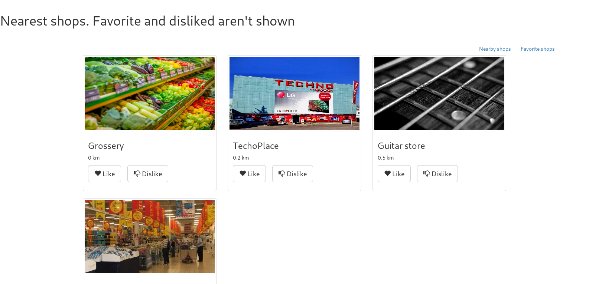

# Web Coding Challenge - Shopzz

A little web app showing nearby shops for United Remote job application process.

## Abstract

In United Remote job application process, this project is intended to take part of the challenge. It's a simple single page application that lists nearby shops from a given position to a user.
This project is only the view of the app. The back end is handled by a microservice which project code is available at [link]. Thus, this project is quite useless without the corresponding active service provider.

## Running the app

The app is a React app created with [Create React App](https://github.com/facebook/create-react-app) which makes it easy to bootstrap it. The sole prerequesite is **Node 8.10.0 or later** intalled on the host machine. Though, it isn't required in production. Then go to the project folder and type ```nmp start```. Then go to [http://localhost:3000/](http://localhost:3000/).

## Project structure

As mentioned earlier, although this project is only the view of the whole app, it's structure can be interesting.

As a meaningful React app, all the logic goes in the *.js files. The logic is basically splited in two parts:
* Authentication
* App content

### Authentication

Authentication files go in ```/src/auth/``` folder. Basically, a form is layed out - a login for or a registration from according to user's actions. Forms are compound of ```TextControl``` objects and buttons. ```TextControl```'s are automated input fields that embed a validation logic (empty, regex etc.) and feedback their state to their parent which is a form (login or registration).

### App content
The main part of the app goes in ```/src/app/``` folder. It contains ```AppContent``` and ```Shop``` classes. ```AppContent``` class is responsible of laying out the shop according to the user's position, favorite and disliked shops. Actually it just sends the right request to the service. ```Shop``` class takes care of shop instances by embedding all their useful properties.

## Session management

As the app needs to know which user is currently logged in order to display corresponding shop lists, users connection has to be registered by the server. A cookie containing a *hashcode* is store on the client device imitating web servers session management. This cookie is added in all request of a logged in client and it's expiration date is refreshed. Server handles hashcode and user mapping.

## Screenshots

### Authentication page


### Registration page
_Controls are automated and feedback their state to the form which makes the validation button available only if every single control is valid_ 


### Showing nearby shops
_When showing nearby shops, neither favorite and disliked shops are visible. To see disliked shops user has no choice than waiting a timeout._


### Showing favorite shops


## Authors

* **Toumani** - *Initial work* - [Code Challenge](https://github.com/Toumani/web-coding-challenge/)

## License

This project is licensed under the MIT License 